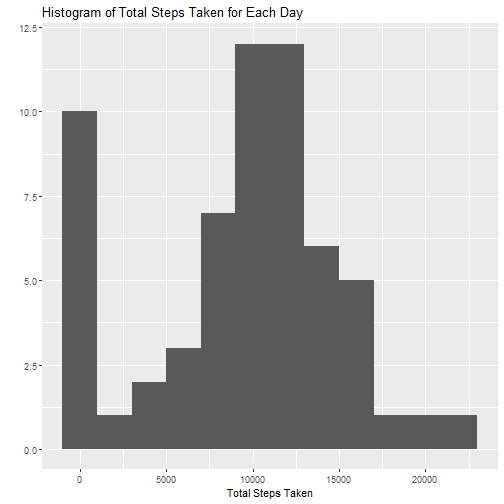
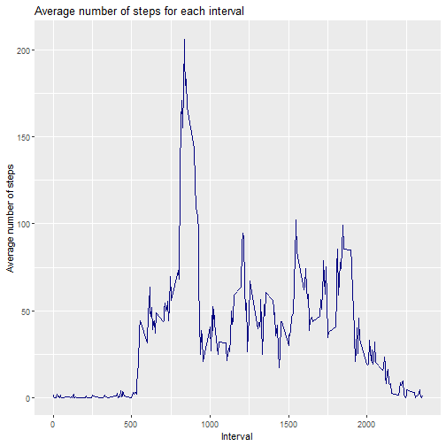
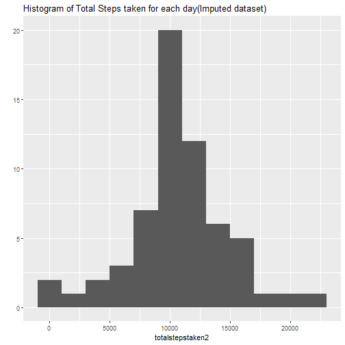
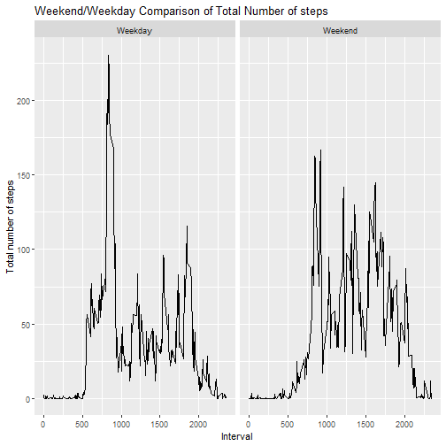

##Reproducible Research Project


###Unzipping/Reading data into workspace

```r
unzip('repdata%2Fdata%2Factivity.zip')
actdata <- read.csv('activity.csv')
```
###What is mean total number of steps taken per day?  
We will first ignore the missing values denoted as NA


```r
totalstepstaken <- with(actdata,tapply(steps,date,sum,na.rm=TRUE))
library(ggplot2)
qplot(totalstepstaken,binwidth=2000,main='Histogram of Total Steps Taken for Each Day',xlab='Total Steps Taken')
```



We see that there's many days with around 10000 steps.  
We also see that there's considerably many days with no steps, probabily due to missing values


```r
mean(totalstepstaken)
```

```
## [1] 9354.23
```

```r
median(totalstepstaken)
```

```
## [1] 10395
```

We can find that mean of total number of steps taken for one day is 9354.23 steps, and its median is 10395


###What is the average daily activity pattern?

```r
library(dplyr)
grouped <- group_by(actdata,interval)
summarizeddata <- summarize(grouped,msteps=mean(steps,na.rm=TRUE))
summarizeddata
```

```
## # A tibble: 288 x 2
##    interval msteps
##       <int>  <dbl>
##  1        0 1.72  
##  2        5 0.340 
##  3       10 0.132 
##  4       15 0.151 
##  5       20 0.0755
##  6       25 2.09  
##  7       30 0.528 
##  8       35 0.868 
##  9       40 0     
## 10       45 1.47  
## # ... with 278 more rows
```

Before we visualize the data to answer the question, we can transform the dataset to peek at the mean steps taken for each 5-min interval


```r
#Line plot
ggplot(summarizeddata,aes(interval,msteps)) + geom_line(color='navy') +labs(x='Interval',y='Average number of steps',title='Average number of steps for each interval')
```



```r
#Max interval
summarizeddata$interval[summarizeddata$msteps==max(summarizeddata$msteps)]
```

```
## [1] 835
```

Peak of the line graph is at interval 835.

###Imputing missing values  

```r
colSums(is.na(actdata)) #only steps has NA values
```

```
##    steps     date interval 
##     2304        0        0
```

```r
sum(is.na(actdata$steps))/length(actdata$steps)
```

```
## [1] 0.1311475
```

We can see here that only steps column has missing values. 13 percent of this column is missing.  
NA values in steps column will be filled with average number of steps for each corresponding interval.  
The values will be taken from the 'summarizeddata,' which was evaluated for the line plot.


```r
actdata2 <- actdata
#algorithm for filling datas in: interval means using summarizeddata above
for(i in 1:length(actdata2$steps)){
  if(is.na(actdata2$steps[i])){
    inter <- actdata$interval[i]
    actdata2$steps[i] <- summarizeddata[summarizeddata$interval==inter,]$msteps
  }
}
totalstepstaken2 <- with(actdata2,tapply(steps,date,sum,na.rm=TRUE))
#qplot version
qplot(totalstepstaken2,binwidth=2000,main='Histogram of Total Steps taken for each day(Imputed dataset)')
```



```r
mean(totalstepstaken2)
```

```
## [1] 10766.19
```

```r
median(totalstepstaken2)
```

```
## [1] 10766.19
```

And here the values around are subtantially removed. New mean value for imputed data is 10766.19 and is same for median.

###Are there differences in activity patterns between weekdays and weekends?

```r
#Weekdays and weekends
days <- c('Monday','Tuesday','Wednesday','Thursday','Friday')
dayname <- c()
for(i in 1:length(actdata2$date)){
  if(weekdays(as.Date(actdata2$date[i])) %in% days){
    dayname[i] <-'Weekday'
  }else{dayname[i] <- 'Weekend'}
}
actdata2$dayname <- as.factor(dayname)
```

Above will create new factor column for our imputed dataset which distinguishes if each date belongs to weekdays or weekends


```r
dayendinterval <- aggregate(steps ~ interval+dayname,data=actdata2,mean)
ggplot(dayendinterval,aes(interval,steps))+geom_line()+facet_grid(.~dayname)+labs(x='Interval',y='Total number of steps',title='Weekend/Weekday Comparison of Total Number of steps')
```



New aggregated dataset which has mean number of steps for each pair of interval and weeksdays or weekends will first be created.  
Average number of steps for each interval is plotted, devided into two panels, whether the data is from weekdays or weekends.
